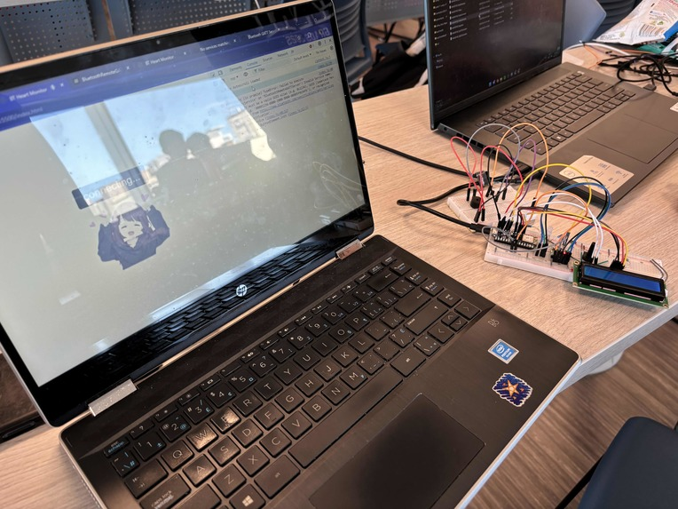

<h1>The programming files used for Serenity, a project made for Hack the Hill.</h1>

Serenity measures heart rate using a MAX30100, displays different colours using an RGB LED based off the heart rate, and plays soothing music in the case of a high heart rate.

Using the Arduino Nano's bluetooth capabilties, the heart rate is sent to a web page using GATT bluetooth API.

